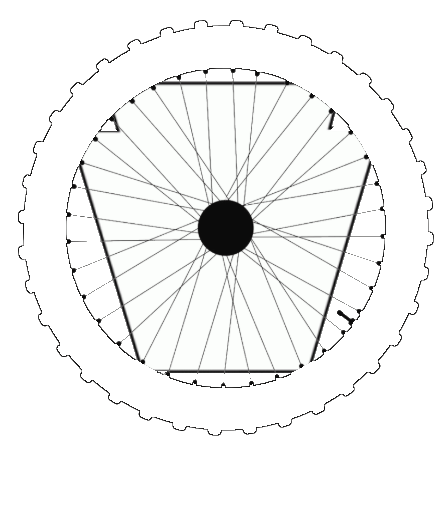
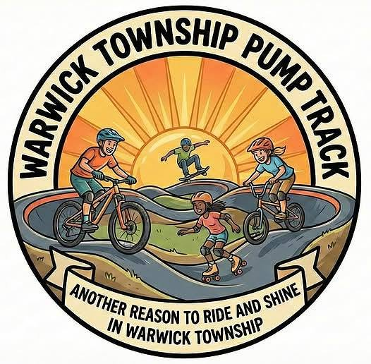

# Lititz BMX Games

**Interactive BMX history, preservation, education, storytelling, and community advocacy.**

[Play Lititz BMX Games](https://article134-tech.github.io/lititzbmx-games/) · [Explore the Lititz BMX Archive](https://www.lititzbmx.com)

<p align="center">
  
</p>

## About the Collection

Lititz BMX Games is the public interactive-experience collection of **Lititz BMX**, an independent BMX archive, preservation project, media platform, and developing private museum and education concept based in Lititz, Pennsylvania.

The collection turns BMX history, archival research, oral-history material, artifacts, educational work, and community initiatives into source-backed experiences that invite people to participate—not simply read.

Each game is designed as its own preserved project with a stable public address, supporting documentation, source material, rights information, and room for future revision without disturbing other releases.

## Now Playing

### Help Brandon Hetrick Build a Pump Track in Warwick Township

<p align="center">
  
</p>

Work through a nine-stage community-planning experience inspired by the real effort to bring a multi-sport pump track to Warwick Township, Pennsylvania.

Players build a coalition, evaluate land, choose a surface, plan accessibility and maintenance, respond to setbacks, and prepare a personalized final proposal.

- **Format:** Nine-stage planning game
- **Estimated time:** 10–15 minutes
- **Outcome:** Personalized community proposal
- **Release:** v1.1.1

[Start the project](https://article134-tech.github.io/lititzbmx-games/brandon/)

## Why These Games Exist

Lititz BMX Games extends the archive beyond static documentation by creating accessible ways to explore:

- BMX history, people, artifacts, and stories
- Preservation and archival research
- Community advocacy and civic planning
- Educational challenges and digital investigations
- The decisions, setbacks, and persistence behind real projects

The goal is not to turn history into trivia. It is to help people understand how BMX history is preserved, how communities are built, and why the stories behind the objects matter.

## Public Architecture

```text
lititzbmx-games/
├── index.html          Collection homepage
├── assets/             Shared collection assets and Lititz BMX branding
├── brandon/            Warwick Township pump-track game
└── future-game/        Future sibling experiences
```

Current public addresses:

- **Collection hub:** https://article134-tech.github.io/lititzbmx-games/
- **Brandon game:** https://article134-tech.github.io/lititzbmx-games/brandon/

Future games will be added as sibling directories so existing releases retain their URLs and remain independently documented.

## Documentation and Source Transparency

Each experience may include its own:

- README and release notes
- Source list or research record
- Rights and disclaimer statement
- Validation report
- Manifest and checksums

The approved Brandon Hetrick v1.1.1 release is preserved inside [`/brandon/`](brandon/) with its supporting documentation and source record.

## Project Status

- **Lititz BMX Games collection hub:** v1.0.2
- **Help Brandon Hetrick Build a Pump Track in Warwick Township:** v1.1.1
- **Repository:** `Article134-tech/lititzbmx-games`
- **GitHub Pages:** Live
- **Custom domain:** Reserved for a later controlled deployment

## About Lititz BMX

Lititz BMX documents BMX artifacts, riders, manufacturers, teams, events, media, and community history through physical preservation, digital cataloging, original research, oral-history interviews, educational resources, and public media.

The archive is founded and maintained by **Kyle A. Huffman**, a retired instructional designer, twice-deployed United States Navy veteran, lifelong BMX enthusiast, collector, researcher, interviewer, and media producer.

[Visit Lititz BMX](https://www.lititzbmx.com)

## Rights and Use

Project-specific rights, attribution, educational-use, and disclaimer information is documented in [`RIGHTS-AND-DISCLAIMER.md`](RIGHTS-AND-DISCLAIMER.md) and within each individual game directory.
